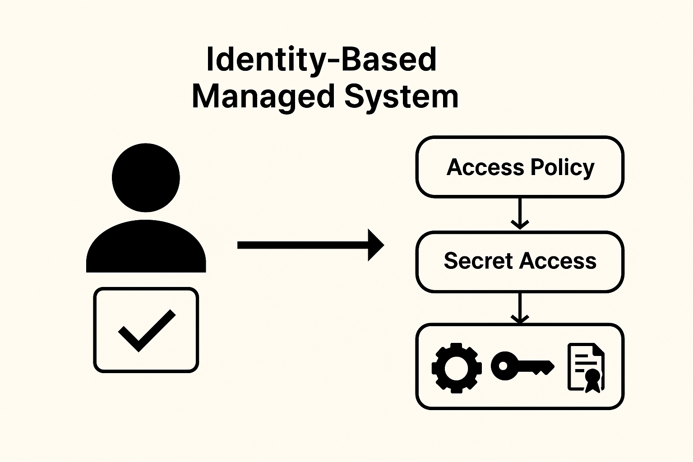

# Introduction to Identity Based Managed System

[HashiCorp Vault Learning Series Main Menu](https://github.com/rajatagrawal1094/HashiCorpVault)

## Table of Contents
- [Introduction](#introduction)
- [The Problem with Traditional Secrets Management](#the-problem-with-traditional-secrets-management)
- [Introduction to Identity Based Management Systems](#introduction-to-identity-based-management-systems)
- [Bridging the Gap for Business Leaders and DevOps Engineers](#bridging-the-gap-for-business-leaders-and-devops-engineers)
- [Popular Identity Based Secrets Management Tools](#popular-identity-based-secrets-management-tools)
- [How to Choose the Right Tool for Your Organization](#how-to-choose-the-right-tool-for-your-organization)
- [Summary](#summary)

## Introduction

In today’s digital world, most of us—whether we’re writing code, deploying apps, or managing infrastructure—deal with sensitive information every single day.

These secrets come in many forms:

- API keys  
- Passwords  
- TLS/SSL certificates  
- Tokens

They may seem like small pieces of data, but if mishandled, they can lead to serious breaches, data leaks, or compliance violations.

So how do we manage secrets responsibly, especially as our systems grow in scale and complexity?

## The Problem with Traditional Secrets Management

We’ve all seen it—secrets hardcoded into apps, stored in config files, or shared in spreadsheets or chat threads. These methods might have worked early on, but they simply don’t scale. And more importantly, they’re risky.

Some of the challenges we face with traditional approaches include:

- **No central visibility**: Who has access to which secret? When was it last used or rotated?
- **Limited access control**: If someone knows a secret, they can usually access it anytime—regardless of their role or context.
- **Inconsistent practices**: Each team may handle secrets differently, leading to gaps, duplication, and vulnerabilities.

## Introduction to Identity Based Managed Systems

To fix this, more and more teams are adopting identity-based managed systems. These platforms give us centralized, secure, and policy-driven control over secrets.

*Figure: Identity-based systems validate identity before applying access policies to secrets like keys, tokens, and certificates.*

Here’s why identity-based management makes a real difference:

- **Access is tied to who you are**—a developer, an app, or even a machine identity—not just what you know.
- **It controls when and how access happens**, using just-in-time permissions, time-limited credentials, and strict scopes—minimizing any window for abuse or misuse.
- **Every access is auditable**—with timestamps, identity logs, and access methods recorded for full traceability.
- **It integrates into our existing workflows**—secrets are injected into apps at runtime and rotated automatically, without adding friction.

As we move toward cloud-native architectures and microservices, our secret sprawl is only growing. Identity-based systems help us stay secure while remaining agile and fast-moving.

And perhaps most importantly—they follow the **Zero Trust principle**: never assume, always verify.

## Bridging the Gap for Business Leaders and DevOps Engineers

Whether you're on the business side or the engineering side, identity-based secrets management offers something valuable.

**As business leaders**, you want to ensure security isn’t a bottleneck. These systems help embed governance into daily workflows and give your teams the confidence to scale securely.

**As DevOps engineers**, you’re looking for automation, velocity, and security that won’t slow you down—and these tools make that possible.

Together, we all benefit:

- Security teams get visibility and control.  
- Engineers get tools that work with—not against—their pipelines.  
- Leaders get peace of mind about risk and compliance.

## Popular Identity Based Secrets Management Tools

There are several mature tools available that support identity-based access and secrets management. Here’s a snapshot of the most popular ones:

| **Tool**                    | **Primary Use Case**                    | **Best For**                           | **Notable Features**                                                                 |
|----------------------------|----------------------------------------|----------------------------------------|---------------------------------------------------------------------------------------|
| **HashiCorp Vault**     | General-purpose secrets management     | Multi-cloud and hybrid environments    | Dynamic secrets, fine-grained access control, identity-based policies, PKI, rotation |
| **AWS Secrets Manager** | Cloud-native secrets management        | AWS-focused organizations              | Tight AWS IAM integration, automated rotation, native cloud scalability              |
| **Azure Key Vault**     | Secrets and key management on Azure    | Microsoft ecosystems                   | Azure AD integration, RBAC, managed HSM, secure access policies                      |
| **Google Secret Manager** | Secure secrets for GCP apps          | GCP environments                       | IAM-based access, versioned secrets, audit logging, GCP integrations                 |
| **CyberArk Conjur**     | Enterprise-grade DevOps secrets        | Highly regulated industries            | Kubernetes support, policy as code, secrets injection, enterprise RBAC               |
| **IBM Secrets Manager**| Enterprise secret/key management       | IBM Cloud or hybrid enterprises        | Identity federation, centralized lifecycle, compliance tooling                       |

## How to Choose the Right Tool for Your Organization

Finding the right tool isn’t just a technical decision—it’s a strategic one. It should align with your infrastructure, security model, developer workflows, and compliance requirements.

Here are the key things to think about:

| **Consideration**                    | **Why It Matters**                                                                                                                                             |
|-------------------------------------|----------------------------------------------------------------------------------------------------------------------------------------------------------------|
| **Security & Compliance Readiness** | Supports standards like SOC 2, ISO 27001, HIPAA, or GDPR. Enables strong audit capabilities and policy enforcement for governance and regulatory compliance.    |
| **Integration with Your Ecosystem** | Seamlessly integrates with cloud providers (AWS, Azure, GCP), CI/CD pipelines, Kubernetes, Terraform, and identity providers (LDAP, SSO, IAM roles).           |
| **Secrets Lifecycle Management**     | Automates secret rotation, supports short-lived credentials, enables just-in-time access, and provides version control to minimize risk exposure.             |
| **Access Control & Policy Flexibility** | Allows fine-grained permissions via role-based or attribute-based access control (RBAC/ABAC) to match users, apps, and service identities.                     |
| **Scalability and Performance**      | Handles increasing workloads and diverse deployments across single, hybrid, or multi-cloud environments without degrading performance.                        |
| **Cost and Licensing Model**         | Offers pricing that aligns with your scale and strategy—whether SaaS or self-hosted, usage-based or per-user licensing.                                       |
| **Developer Experience & API Support** | Provides robust APIs, CLI tools, and SDKs that make it easy for engineers to integrate secrets management into their workflows and toolchains.                |
| **Operational Overhead & Maintenance** | Requires minimal manual management, with options for fully managed services or easy-to-maintain self-hosted deployments.                                       |
| **Auditability and Observability**   | Delivers detailed logs, monitoring capabilities, and integrations with SIEM tools to support audit, security, and incident response teams.                     |
| **Vendor Flexibility**               | Avoids vendor lock-in by supporting open standards, hybrid and multi-cloud architectures, and portability across environments.                                |

*Start small—maybe with secrets in your CI/CD pipeline—and expand as your confidence grows.*

## Summary

Secrets are everywhere—from our pipelines and cloud services to our internal tools. And trying to manage them manually? It just doesn’t cut it anymore.

Identity-based secrets management systems offer a smarter, more secure way to handle sensitive data. By tying access to who (or what) is requesting it—and controlling when, how, and for how long—it helps us operate with precision and confidence.

For business leaders, this means fewer risks and smoother audits. For engineers, it’s automation without compromise.

Whether you're looking at Vault, AWS Secrets Manager, Azure Key Vault, or something else—the tool may vary, but the principle stays the same:

**Access should always be earned through identity, not assumed by default.**
